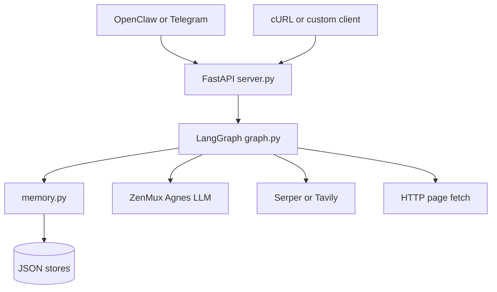
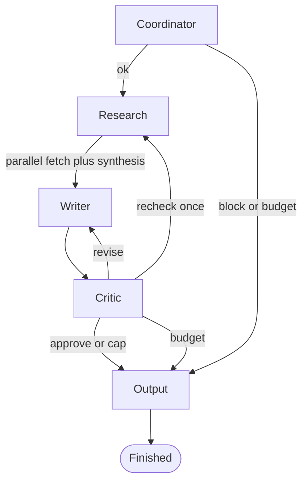

# AgnesClaw (AgnesOps)

## What it is

**AgnesOps** turns a research goal into a cited Markdown report: a **constitution** check, **parallel web research**, **writer** with inline **`[n]` citations**, and a **critic** that debates and scores the draft before delivery. Orchestration is **LangGraph**; the API is **FastAPI** (`/run`, `/run/stream`); LLM calls go through **ZenMux** (OpenAI-compatible). Policy, state, memory, and agents live in separate modules so the pipeline stays easy to trace and test.

---

## Features

### Research and evidence

- **Parallel sub-tasks** with a thread pool, **URL deduplication** (including after a critic-triggered research pass).
- **Smarter “confidence”** — not raw page count. Each fetched page is scored for **readability vs boilerplate** (script shells, trackers, bot-wall patterns). Confidence reflects **high-signal sources** and **how many distinct domains** they come from, so a pile of empty SPAs does not read as “100% sure.”
- **Resilient fetching** — **retries with backoff**, **browser-like HTTP headers**, and an optional **Playwright** pass for short or boilerplate-heavy HTML when `USE_PLAYWRIGHT_FETCH=1` (see [Optional: Playwright](#optional-playwright-for-js-heavy-pages)).
- **Thin evidence → honest synthesis** — when there are **few high-signal extracts**, the synthesiser is nudged to say when schedules/prices are missing and **not to invent** flight-style facts.

### Writing, critic, and output

- **Structured report** with citations tied to a numbered source list.
- **Critic** runs a steelman vs critique debate, then **arbitration scored** on completeness, clarity, and **actionability**, with prompts **anchored to your stated goal** so vague drafts get pressured to answer the ask.
- **Quality badge** on the **API** response (`research_confidence`, critic average, revisions, clean source count). A **travel-style disclaimer** (blockquote) appears when the goal looks travel-related and evidence confidence is below a threshold — reminds users to confirm with carriers and official sources.
- **Writer truncation** — if the draft hits the token limit, a **warning** is visible in `status_messages`; downstream surfaces can use that to tell the user the report may be incomplete.

### API and observability

- **`POST /run`** — full JSON: `final_output`, `status_messages`, `session_log`, critic scores (aggregate + per-axis), `research_confidence`, errors, etc.
- **`POST /run/stream`** — **SSE** with incremental `delta_status`, live metrics, then a final `done` event with the same shape as `/run`.
- **Structured logs** — each run emits a JSON line with `event: run_start`, `session_id`, `user_id`, and goal length (stderr), useful for demos and debugging.

### Telegram experience

The **`telegram_bridge.py`** adapter keeps **API responses unchanged** (badge + footer stay in `final_output` for the web UI and `curl`). On Telegram, users get a **cleaner experience**:

- Short **“On it…”** acknowledgement instead of internal setup text.
- **~5 milestone-style updates** (e.g. preparing plan, researching, writing, refining) — noisy lines like per-sub-task source counts are **filtered**; **writer truncation warnings** still pass through **verbatim** when they occur.
- **Final message** has the **badge and run footer stripped** so users see the **report body** (and **travel disclaimer** when present). If a run was **truncated at the token limit**, a **plain-language note** is appended to the final message.
- **Typing indicator** while the stream is open, plus a **“still running”** nudge if there is **no new status for ~120s**.
- **`/start` / `/help`** — one-line invite to send a research question (no env-tuning jargon).
- Set **`TELEGRAM_LIVE_STATUS=0`** for a single **`POST /run`** and one reply when the run finishes (fewer messages, useful if SSE is flaky). **`AGNES_RUN_TIMEOUT_SEC`** caps wait time (default 900s).

### Optional and future

- **`docs/tinyfish-hook.md`** — how a future **TinyFish** (or similar) render API could plug in for the hardest bot-wall pages; **no vendor integration in-repo** until you add credentials and code.

**Research confidence is not “booking accuracy.”** It is a **heuristic** over extract quality and domain spread. Use it as a **signal**, not a guarantee of correct schedules, prices, or entry rules.

---

## High-level architecture

Clients call a small FastAPI surface. The app builds one **frontier state** (budgets, provenance, scores) and runs a single **LangGraph** execution. Agents update state and set `next_agent`; `graph.py` wires routes. Research uses search + HTTP fetch; synthesis caps context for smaller models. Memory is file-backed JSON (`/history`, `/skills`).



**API endpoints**

| Endpoint | Role |
|----------|------|
| `GET /health` | Liveness: `status`, `model`, `search_provider`. |
| `GET /history/{user_id}` | Past run summaries from `memory_store.json`. |
| `GET /skills` | Skill library from `skill_store.json`. |
| `POST /run` | Full async run; full `final_output` (badge + body + footer), scores, `status_messages`, etc. |
| `POST /run/stream` | SSE: incremental `delta_status` and metrics; final event `done: true` + same fields as `/run`. |

**Live demo UI:** open **`demo.html`** (CORS toward your API). Set `API_BASE` in the script if the host/port differs.

---

## Agent graph



---

## Repository layout

| Path | Responsibility |
|------|------------------|
| `server.py` | FastAPI, `build_initial_state`, `/run`, `/run/stream`, logging, `/health`, `/history`, `/skills`. |
| `telegram_bridge.py` | Telegram polling; SSE or sync run; **feature-filtered** copy for DMs. |
| `demo.html` | SSE client, metrics, Markdown rendering. |
| `graph.py` | LangGraph definition. |
| `state.py` | `AgentState` contract. |
| `constitution.md` | Coordinator policy. |
| `memory.py` | Runs, skills, JSON stores. |
| `agents/*.py` | Coordinator, research, writer, critic, output. |
| `openclaw/` | OpenClaw / persona stubs. |
| `docs/tinyfish-hook.md` | Optional future fetch backend notes. |
| `.env.example` | Env template (ZenMux, search, Telegram, optional Playwright flag). |

---

## Quick start

```bash
python -m venv .venv && source .venv/bin/activate
pip install -r requirements.txt
cp .env.example .env   # fill ZENMUX_API_KEY and the search key for SEARCH_PROVIDER
uvicorn server:app --host 127.0.0.1 --port 8000
```

Example:

```bash
curl -s -X POST http://127.0.0.1:8000/run \
  -H "Content-Type: application/json" \
  -d '{"goal":"Your research question here","user_id":"local-test","channel":"web"}'
```

### Telegram (local or hosted API)

```bash
# Terminal 1
uvicorn server:app --host 127.0.0.1 --port 8000

# Terminal 2 — TELEGRAM_BOT_TOKEN and AGNES_API_BASE in .env
python telegram_bridge.py
```

Message the bot with a **research question** (not only `/start`). Default mode uses **`/run/stream`** with the **simplified milestone + clean report** behavior above. Use **`TELEGRAM_LIVE_STATUS=0`** for one **`/run`** and a single final message. For a remote API, set **`AGNES_API_BASE`** to that URL.

Do not commit `.env`; rotate any key that has been shared or logged.

### Optional: Playwright for JS-heavy pages

```bash
pip install -r requirements-playwright.txt
playwright install chromium
```

Set **`USE_PLAYWRIGHT_FETCH=1`** in `.env`. Plain **httpx** fetch runs first; Playwright only helps when the stripped page still looks empty or boilerplate-heavy. Adds latency and browser weight — leave off unless you need it.
