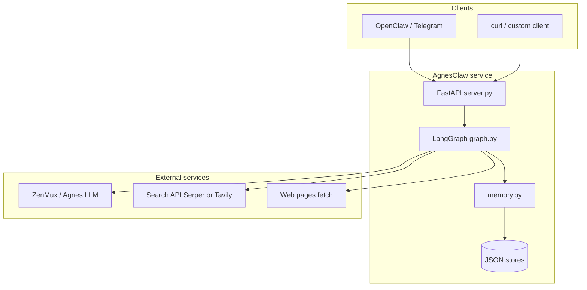
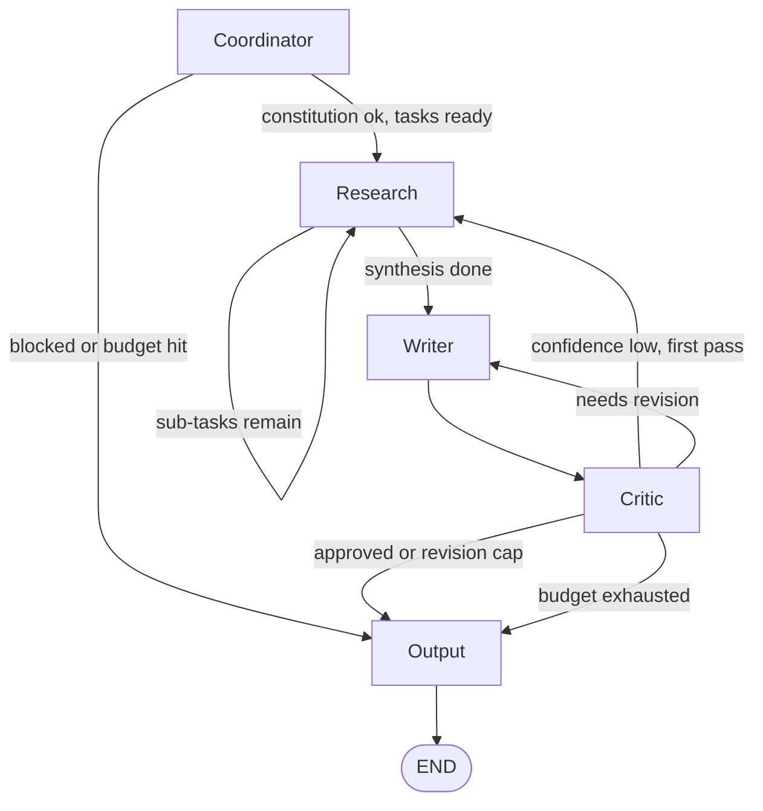

# AgnesClaw (AgnesOps)

## Objective

**AgnesOps** is a multi-agent research and writing pipeline: a user states a goal, the system checks it against a written **constitution**, decomposes it into sub-tasks, runs **real web search** with basic **prompt-injection sanitisation**, drafts a structured Markdown report, and passes it through a **critic** (debate-style review and scored feedback) before returning a final answer. The default stack uses **Agnes** via an OpenAI-compatible API (**ZenMux**) for LLM calls, **LangGraph** for orchestration, and **FastAPI** as the HTTP API. Optional **OpenClaw** configuration (under `openclaw/`) describes how to expose the same backend to channels such as Telegram.

The repository’s purpose is to keep **policy** (`constitution.md`), **shared state** (`state.py`), **persistence** (`memory.py`), and **agent behaviour** (`agents/`) separate so the graph stays testable and the demo narrative (“constitution → research → write → critic → output”) stays traceable.

---

## High-level architecture

At the highest level, clients call a small FastAPI surface. The app builds a single **frontier state** object (budgets, provenance, scores) and runs one **LangGraph** execution. Agents mutate that state and set `next_agent`; only `graph.py` wires transitions. Research talks to external search and fetch HTTP APIs, not to the LLM, for current web facts. Memory is file-backed JSON for user history, distilled “skills,” and a small cross-goal source cache.



**API endpoints**

| Endpoint | Role |
|----------|------|
| `POST /run` | Full run; returns `final_output`, `status_messages`, `session_log`, scores, errors. |
| `POST /run/stream` | Same run as **Server-Sent Events**; emits incremental `status_messages` / frontier metrics for live UIs. |

---

## Agent graph

Each node is a Python function that reads and updates the shared `AgentState` (`state.py`). Routing is **data-driven**: after every step, LangGraph evaluates `route(state)` → `state["next_agent"]` and follows the matching edge. The **output** node always terminates the run (`output` → `END`); it formats the deliverable, appends a short provenance footer, and calls `save_run`.

Typical control flow (actual wiring is the same `next_agent` mechanism from every node):



---

## Repository layout

| Path | Responsibility |
|------|------------------|
| `server.py` | FastAPI app, initial state construction, `/run` and `/run/stream`. |
| `graph.py` | LangGraph definition and compiled `graph`. |
| `state.py` | `AgentState` TypedDict — single contract for all agents. |
| `constitution.md` | Rules the coordinator enforces before research. |
| `memory.py` | User runs, skill distillation, community source cache (JSON files). |
| `agents/*.py` | Coordinator, research, writer, critic, output implementations. |
| `openclaw/` | Agent persona and skill stubs for OpenClaw/Telegram integration. |
| `.env.example` | Required env vars (ZenMux, search provider, critic threshold, optional Telegram). |

---

## Quick start

```bash
python -m venv .venv && source .venv/bin/activate
pip install -r requirements.txt
cp .env.example .env   # fill ZENMUX_API_KEY and the search key for SEARCH_PROVIDER
uvicorn server:app --host 127.0.0.1 --port 8000
```

Example request:

```bash
curl -s -X POST http://127.0.0.1:8000/run \
  -H "Content-Type: application/json" \
  -d '{"goal":"Your research question here","user_id":"local-test","channel":"telegram"}'
```

Do not commit `.env`; rotate any key that has been shared or logged.

---

## Further reading

The full step-by-step build plan and verification notes live in `.claude/plans/projet-overview.md` (local / optional copy in your workspace; adjust paths if you move docs into git explicitly).
