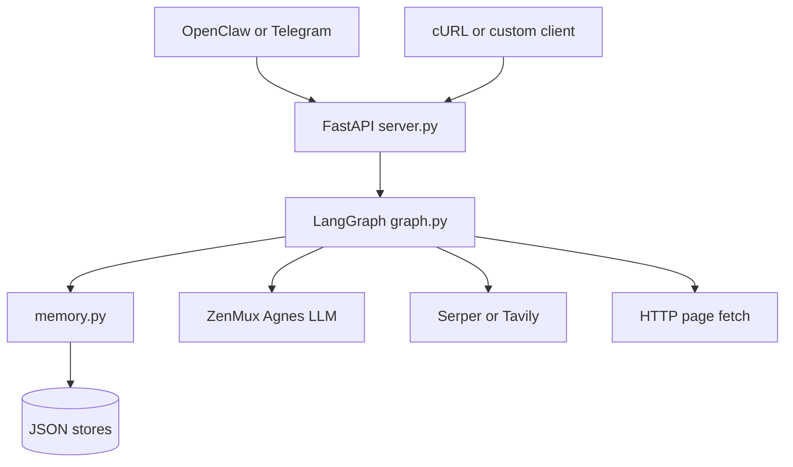
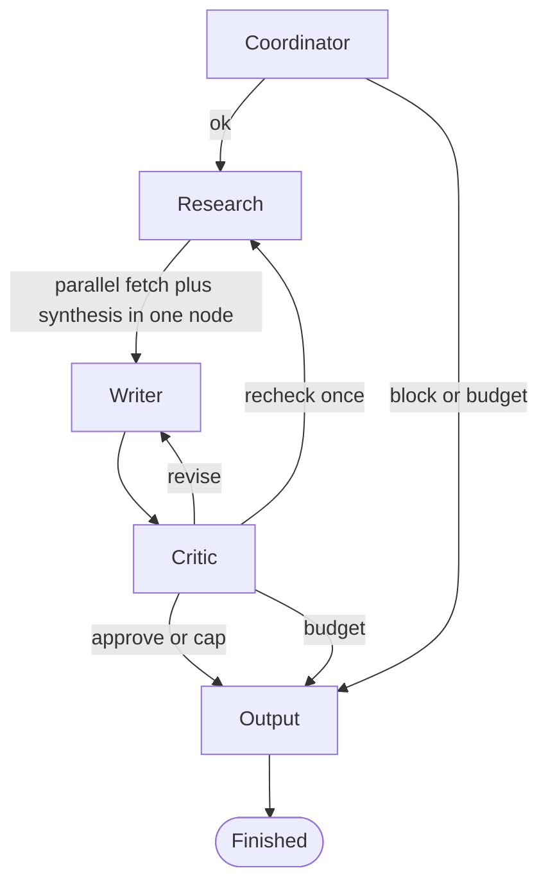

# AgnesClaw (AgnesOps)

## Objective

**AgnesOps** is a multi-agent research and writing pipeline: a user states a goal, the system checks it against a written **constitution**, decomposes it into sub-tasks, runs **real web search** with basic **prompt-injection sanitisation**, drafts a structured Markdown report with **inline `[n]` citations** (from a numbered source list), and passes it through a **critic** (debate-style review and scored feedback). The **research** node runs sub-tasks **in parallel** (thread pool + URL dedup, including after critic “recheck” routing). **Output** prepends a small **quality badge** (confidence, critic score, revisions, source count). The default stack uses **Agnes** via an OpenAI-compatible API (**ZenMux**) for LLM calls, **LangGraph** (pinned `>=0.1.0` for `ainvoke` / `astream`) for orchestration, and **FastAPI** with **async** `/run` and `/run/stream`. Optional **OpenClaw** configuration (under `openclaw/`) describes how to expose the same backend to channels such as Telegram.

The repository’s purpose is to keep **policy** (`constitution.md`), **shared state** (`state.py`), **persistence** (`memory.py`), and **agent behaviour** (`agents/`) separate so the graph stays testable and the demo narrative (“constitution → research → write → critic → output”) stays traceable.

---

## High-level architecture

At the highest level, clients call a small FastAPI surface. The app builds a single **frontier state** object (budgets, provenance, scores) and runs one **LangGraph** execution (`ainvoke` / `astream` under the hood). Agents mutate that state and set `next_agent`; only `graph.py` wires transitions. Research talks to external search and fetch HTTP APIs, not to the LLM, for current web facts; synthesis caps context (e.g. top clean sources, truncated per page) for smaller models. Memory is file-backed JSON for user history, distilled “skills,” and a small cross-goal source cache—surfaced via **`/history/{user_id}`** and **`/skills`**.

Below uses `graph TD`, short labels, and no quoted subgraph titles so it matches [GitHub-flavored Mermaid](https://github.blog/developer-skills/github/include-diagrams-markdown-files-mermaid/) more reliably. If the diagram still shows a blank box or “chunk failed”, try a hard refresh; that error is often GitHub’s viewer failing to load its Mermaid JS bundle, not your syntax.



**API endpoints**

| Endpoint | Role |
|----------|------|
| `GET /health` | Liveness: `status`, configured `model`, `search_provider`. |
| `GET /history/{user_id}` | Summaries of past runs from `memory_store.json`. |
| `GET /skills` | Distilled skill library from `skill_store.json`. |
| `POST /run` | Full async run; JSON includes `final_output`, `status_messages`, `session_log`, **`critic_score`** (top-level, backward compatible), **`scores`** (`critic`, `completeness`, `clarity`, `actionability`), `research_confidence`, `error`, etc. |
| `POST /run/stream` | **SSE** (`text/event-stream`): incremental `delta_status`, metrics, per-axis critic fields; final event has `done: true` plus the same body shape as `/run`. |

**Live demo UI:** open **`demo.html`** in a browser (with CORS enabled on the API). It posts to `http://127.0.0.1:8000/run/stream` and renders Markdown output. Change the `API_BASE` constant in the script if the server host or port differs.

---

## Agent graph

Each node is a Python function that reads and updates the shared `AgentState` (`state.py`). Routing is **data-driven**: after every step, LangGraph evaluates `route(state)` → `state["next_agent"]` and follows the matching edge. The **output** node always terminates the run (`output` → `END`); it formats the deliverable, appends a short provenance footer, and calls `save_run`.

Typical control flow (actual wiring is the same `next_agent` mechanism from every node):



---

## Repository layout

| Path | Responsibility |
|------|------------------|
| `server.py` | FastAPI: CORS, `build_initial_state`, async `/run` / `/run/stream`, `/health`, `/history`, `/skills`. |
| `demo.html` | Single-file SSE client: agent strip, metrics, Markdown report (Tailwind + marked). |
| `graph.py` | LangGraph definition and compiled `graph`. |
| `state.py` | `AgentState` TypedDict — single contract for all agents. |
| `constitution.md` | Rules the coordinator enforces before research. |
| `memory.py` | User runs, skill distillation, community source cache (JSON files). |
| `agents/*.py` | Coordinator, research, writer, critic, output implementations. |
| `openclaw/` | Agent persona and skill stubs for OpenClaw/Telegram integration. |
| `.env.example` | Required env vars (ZenMux, search provider, critic threshold, optional Telegram). |

---

## Quick start

```bash
python -m venv .venv && source .venv/bin/activate
pip install -r requirements.txt
cp .env.example .env   # fill ZENMUX_API_KEY and the search key for SEARCH_PROVIDER
uvicorn server:app --host 127.0.0.1 --port 8000
```

Then open `demo.html` locally, or probe the API:

Example request:

```bash
curl -s -X POST http://127.0.0.1:8000/run \
  -H "Content-Type: application/json" \
  -d '{"goal":"Your research question here","user_id":"local-test","channel":"telegram"}'
```

### Telegram (same laptop as the API)

`getUpdates` only proves the bot receives chats. To **run AgnesOps from Telegram**, start the API and the bridge:

```bash
# Terminal 1
uvicorn server:app --host 127.0.0.1 --port 8000

# Terminal 2 (needs TELEGRAM_BOT_TOKEN and AGNES_API_BASE in .env)
python telegram_bridge.py
```

Then message **`@AgnesHackathonBot`** with a research goal (not only `/start`). By default the bridge uses **`/run/stream`**: you get **several Telegram texts** as the pipeline runs (same `status_messages` as the backend), then the **full report**. Set **`TELEGRAM_LIVE_STATUS=0`** in `.env` if you only want one “Running…” plus the final message. The terminal running `telegram_bridge.py` also **prints** each SSE line so you can observe processing there. For a **hosted** API, set `AGNES_API_BASE` to that public URL instead.

Do not commit `.env`; rotate any key that has been shared or logged.
